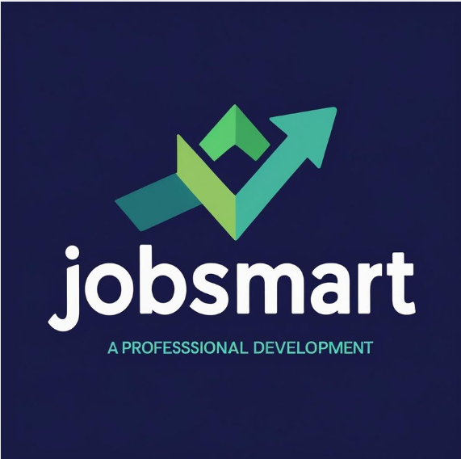

# JOBSMART - Intelligent Job Recommendation Portal

**A PROFESSIONAL DEVELOPMENT**

🚀 **[Open JOBSMART App](https://jobsmart.vercel.app/)**

## Main Features

### For Job Seekers
- **AI-Powered Recommendations**: Get personalized job matches with percentage scores
- **Smart Dashboard**: Track applications, view profile insights, and monitor progress
- **Advanced Job Search**: Filter by skills, location, experience, salary, and company type
- **Application Tracking**: Monitor applied, shortlisted, and rejected applications

### For Recruiters & Admins
- **Job Management**: Post, edit, and manage job listings with full CRUD operations
- **User Management**: View and manage job seeker profiles and activities
- **Analytics Dashboard**: Track system metrics with interactive charts and graphs

### Core Technology
- Built with **Next.js 14**, **React**, and **TypeScript**
- Modern UI with **Tailwind CSS** and **shadcn/ui** components
- Responsive design with professional dark theme
